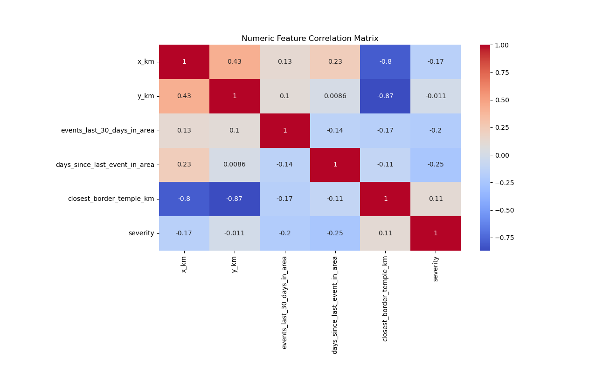

# Border-risk-intelligence-system

## Background

This project was developed as part of a National Geospatial-Intelligence Agency (NGA) and T-REX sponsored academic competition focused on analyzing escalation dynamics along the Thai–Cambodian border.

The objective was to model instability along a contested international boundary using structured spatial and temporal analysis rather than isolated incident reporting.

To accomplish this, our team designed a full analytical pipeline that ingests conflict event data, normalizes it into a standardized schema, engineers spatial and escalation features, and detects structured patterns of instability.

Raw event data collected by the team was processed through a custom parser that:

- Standardized heterogeneous source formats
- Normalized actor and event classifications
- Calculated geodesic distances to the international border
- Measured proximity to key strategic landmarks
- Engineered temporal escalation indicators within defined geographic areas

The processed dataset was then ingested into a DBSCAN clustering model to identify density-based escalation zones without predefining the number of clusters. This allowed us to differentiate between sustained escalation environments and isolated incidents.

Clustered outputs were exported into ArcGIS, where spatial patterns were visualized and analyzed to develop a structured geospatial narrative of border instability.

The result was an end-to-end intelligence workflow:

data ingestion → structured parsing → feature engineering → density-based clustering → geospatial visualization → analytical interpretation

This project demonstrates how spatial-temporal modeling can transform raw event data into interpretable escalation insights within a national security context.

---

# Analytical Visualizations

## Correlation Matrix

This matrix visualizes relationships between the engineered spatial and temporal features used in the DBSCAN clustering model. Variables include spatial location, recent event activity, distance to the border and the Preah Vihear Temple area, and calculated event severity. These relationships help identify which factors contribute most strongly to escalation patterns along the Thai–Cambodian border.

---

## High-Risk Cluster Identification

This visualization highlights one of the primary clusters identified by the DBSCAN model. The **Sa Kaeo–Banteay Meanchey** and **Surin–Oddar Meanchey** regions display high concentrations of severe events and fatalities. The density and severity of events within these regions indicate a higher probability of future border clashes compared to other areas along the border.

---

## Severity-Based Incident Mapping

Conflict events were assigned a severity score based on event type and casualty presence. Military offensives and battles were weighted as the highest severity events, while lower-impact activities such as troop movements or protests received lower scores. Events involving casualties received an additional severity modifier. Mapping these scores allows high-risk locations to be visually distinguished from lower-intensity incidents.

---

## DBSCAN Cluster Distribution

This map shows all spatial clusters identified by the DBSCAN algorithm along the Thai–Cambodian border. The model groups events occurring in close geographic proximity while filtering isolated incidents as noise. Cluster analysis revealed two primary escalation hotspots: the **Sa Kaeo–Banteay Meanchey region** and the **Surin–Oddar Meanchey region**. These areas exhibited both higher event frequency and greater severity, suggesting an elevated likelihood of renewed conflict escalation.

